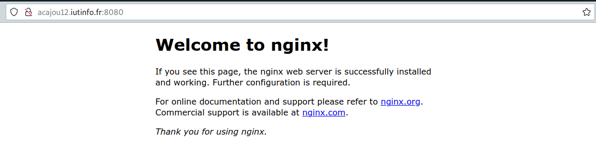
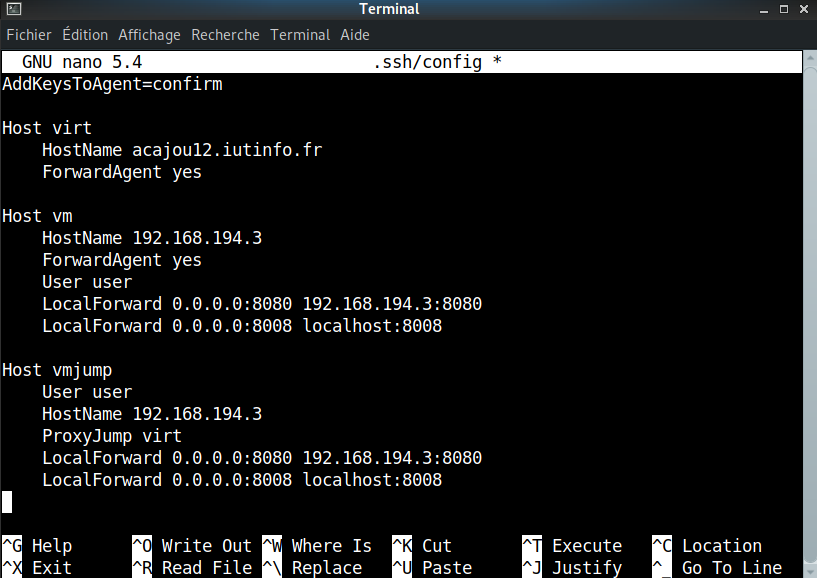

## 4.1 Accès à un service HTTP sur la VM

!!! info Informations
    Pour que le service que vous allez installer soit accessible de toutes les machines de TP de l’IUT, celui-ci doit écouter sur les interfaces réseaux de votre machine de virtualisation.  
    Or, vous allez installer vos services dans votre machine virtuelle. Pour rappel, le réseau virtuel principal, dans lequel se situe votre VM, n’est accessible que depuis la machine de virtualisation.

### 4.1.1 Un premier service pour tester

#### 4.1.1.1 Installation d'un serveur HTTP `nginx` dans votre machine virtuelle

```bash
(vm)root@matrix:~# apt-get install nginx
```

#### 4.1.1.2 Vérification que le serveur est demarré

```bash
(vm)root@matrix:~# systemctl status nginx
```

!!! success Vérification valide
    Active : active (running)

#### 4.1.1.3 Installation du client HTTP en mode texte curl

```bash
(vm)root@matrix:~# apt-get install curl
```

#### 4.1.1.4 Vérification d'accès au serveur nginx depuis la VM 

##### 4.1.1.4.1 Machine virtuelle

```bash
(vm)user@matrix:~# curl http://localhost
```

```bash
<!DOCTYPE html>
<html>
<head>
<title>Welcome to nginx!</title>
<style>
    body {
        width: 35em;
        margin: 0 auto;
        font-family: Tahoma, Verdana, Arial, sans-serif;
    }
</style>
</head>
<body>
<h1>Welcome to nginx!</h1>
<p>If you see this page, the nginx web server is successfully installed and
working. Further configuration is required.</p>

<p>For online documentation and support please refer to
<a href="http://nginx.org/">nginx.org</a>.<br/>
Commercial support is available at
<a href="http://nginx.com/">nginx.com</a>.</p>

<p><em>Thank you for using nginx.</em></p>
</body>
</html>
````

##### 4.1.1.4.2 Machine de virtualisation

Essayer de joindre le serveur, cette fois depuis la machine de virtualisation (adapter la commande)

```bash
(virtu)utilisateur@acajou12:~$ export http_proxy=http://cache.univ-lille.fr:3128
```

```bash
(virtu)utilisateur@acajou12:~$ curl http://localhost
```

```bash
<!DOCTYPE html PUBLIC "-//W3C//DTD HTML 4.01//EN" "http://www.w3.org/TR/html4/strict.dtd">
<html><head>
<meta type="copyright" content="Copyright (C) 1996-2015 The Squid Software Foundation and contributors">
<meta http-equiv="Content-Type" content="text/html; charset=utf-8">
<title>ERROR: The requested URL could not be retrieved</title>
<style type="text/css"><!--
 /*
 * Copyright (C) 1996-2016 The Squid Software Foundation and contributors
 *
 * Squid software is distributed under GPLv2+ license and includes
 * contributions from numerous individuals and organizations.
 * Please see the COPYING and CONTRIBUTORS files for details.
 */

/*
 Stylesheet for Squid Error pages
 Adapted from design by Free CSS Templates
 http://www.freecsstemplates.org
 Released for free under a Creative Commons Attribution 2.5 License
*/

/* Page basics */
* {
	font-family: verdana, sans-serif;
}

html body {
	margin: 0;
	padding: 0;
	background: #efefef;
	font-size: 12px;
	color: #1e1e1e;
}

/* Page displayed title area */
#titles {
	margin-left: 15px;
	padding: 10px;
	padding-left: 100px;
	background: url('/squid-internal-static/icons/SN.png') no-repeat left;
}

/* initial title */
#titles h1 {
	color: #000000;
}
#titles h2 {
	color: #000000;
}

/* special event: FTP success page titles */
#titles ftpsuccess {
	background-color:#00ff00;
	width:100%;
}

/* Page displayed body content area */
#content {
	padding: 10px;
	background: #ffffff;
}

/* General text */
p {
}

/* error brief description */
#error p {
}

/* some data which may have caused the problem */
#data {
}

/* the error message received from the system or other software */
#sysmsg {
}

pre {
    font-family:sans-serif;
}

/* special event: FTP / Gopher directory listing */
#dirmsg {
    font-family: courier;
    color: black;
    font-size: 10pt;
}
#dirlisting {
    margin-left: 2%;
    margin-right: 2%;
}
#dirlisting tr.entry td.icon,td.filename,td.size,td.date {
    border-bottom: groove;
}
#dirlisting td.size {
    width: 50px;
    text-align: right;
    padding-right: 5px;
}

/* horizontal lines */
hr {
	margin: 0;
}

/* page displayed footer area */
#footer {
	font-size: 9px;
	padding-left: 10px;
}


body
:lang(fa) { direction: rtl; font-size: 100%; font-family: Tahoma, Roya, sans-serif; float: right; }
:lang(he) { direction: rtl; }
 --></style>
</head><body id=ERR_ACCESS_DENIED>
<div id="titles">
<h1>ERROR</h1>
<h2>The requested URL could not be retrieved</h2>
</div>
<hr>

<div id="content">
<p>The following error was encountered while trying to retrieve the URL: <a href="http://localhost/">http://localhost/</a></p>

<blockquote id="error">
<p><b>Access Denied.</b></p>
</blockquote>

<p>Access control configuration prevents your request from being allowed at this time. Please contact your service provider if you feel this is incorrect.</p>

<p>Your cache administrator is <a href="mailto:webmaster?subject=CacheErrorInfo%20-%20ERR_ACCESS_DENIED&amp;body=CacheHost%3A%20localhost%0D%0AErrPage%3A%20ERR_ACCESS_DENIED%0D%0AErr%3A%20%5Bnone%5D%0D%0ATimeStamp%3A%20Wed,%2030%20Nov%202022%2010%3A19%3A54%20GMT%0D%0A%0D%0AClientIP%3A%20172.18.49.39%0D%0A%0D%0AHTTP%20Request%3A%0D%0AGET%20%2F%20HTTP%2F1.1%0AUser-Agent%3A%20curl%2F7.74.0%0D%0AAccept%3A%20*%2F*%0D%0AProxy-Connection%3A%20Keep-Alive%0D%0AHost%3A%20localhost%0D%0A%0D%0A%0D%0A">webmaster</a>.</p>
<br>
</div>

<hr>
<div id="footer">
<p>Generated Wed, 30 Nov 2022 10:19:54 GMT by localhost (squid/3.5.23)</p>
<!-- ERR_ACCESS_DENIED -->
</div>
</body></html>
```
Que se passe-t’il ? Pourquoi ?

!!! failure Accès refusé
    On a des erreurs d'accès car nginx est sur la machine virtuel et non sur la machine de virtualisation. 

!!! success Pour accéder directement au service s'éxecutant sur la machine virtuelle !
    ```bash
    (virtu)utilisateur@acajou12:~$ curl -x 192.168.194.3:80 http://localhost
    ```

### 4.2.2 Accès au service depuis la machine physique

!!! info Informations
    On souhaite maintenant pouvoir accéder au service qui s’exécute sur la machine virtuelle depuis la machine physique. 

!!! question Pourquoi ce n’est pas possible directement ?
    Car on a pas de route direct permettant de nous connecter

!!!tip Astuce
    Pour résoudre ce problème, nous allons nous servir de la fonction tunnel de SSH.
    ```bash
    (virtu)utilisateur@acajou12:~$ ssh -L 0.0.0.0:8080:localhost:80 user@192.168.194.3
    ```

!!! success Résultat sur un navigateur : acajou12.iutinfo.fr:8080
    Note : acajou12 : machine de virtualisation
    

!!! tip Adapter le fichier .ssh/config 
    Adapter le fichier .ssh/config de façon à ne pas avoir à utiliser l’option -L systématiquement (voir le manuel ssh_config(1)).

    ```bash
    (phy)utilisateur@hevea19:~$  nano .ssh/config
    ```

    
