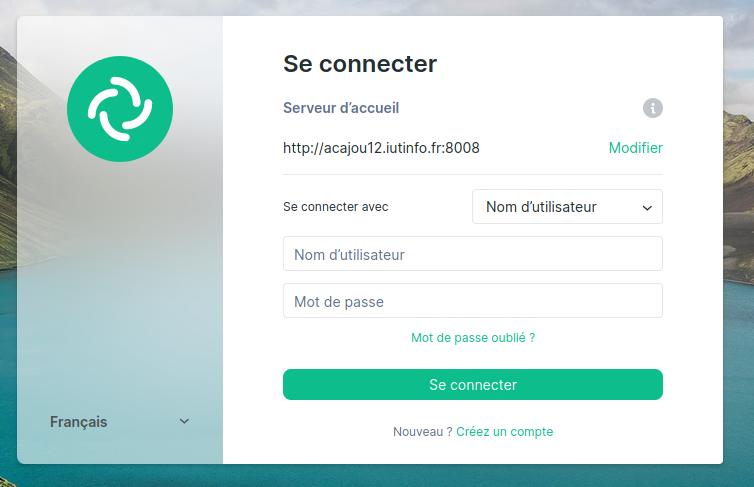

## 4.2 Installation de Synapse

### 4.2.1 Installation du paquet sous Debian

```bash
user@vm# su -l
```

```bash 
root@vm# apt install -y lsb-release wget apt-transport-https
root@vm# wget -O /usr/share/keyrings/matrix-org-archive-keyring.gpg https://packages.matrix.org/debian/matrix-org-archive-keyring.gpg
root@vm# apt update
root@vm# apt update
root@vm# apt install matrix-synapse-py3
```


### 4.2.2 Paramétrage spécifique pour une instance dans un réseau privé

!!! info Informations
    Notre installation est peu commune car votre serveur n’est pas accessible depuis internet. En production réelle, on voudrait qu’il le soit. Les paramètres par défaut de Synapse considèrent donc que votre serveur est accessible de l’extérieur et qu’il ne cherche pas à contacter des éléments situés sur un réseau privé. En particulier, on ne veut pas que notre serveur contacte d’autres serveurs pour obtenir des clés publiques de signatures.

```bash 
root@vm# nano /etc/matrix-synapse/homeserver.yaml
```

!!! note Modification du fichier
    trusted_key_servers : []
    
### 4.2.3 Utilisation d’une base Postgres

!!! warning Attention
    Lors de la séance précédente, nous avons créé une base de données matrix avec les options de création par défaut. Ces options ne conviennent pas à Synapse et il refusera de démarrer si vous ne changez rien à votre base de données.

!!! info Informations
    Il faut recréer la base de données

```bash 
root@vm# dropdb -h localhost -U matrix matrix
```

```bash 
root@vm# nano /etc/matrix-synapse/homeserver.yaml
```

!!! note Modification du fichier homeserver.yaml
    ```yaml
    database:
    name: psycopg2
    args:
        user: matrix
        password: matrix
        database: matrix
        host: localhost
        cp_min: 5
        cp_max: 10
    ```
!!! warning
    Attention à l'indentation du fichier yaml
    Erreur possible si l'indentation (de 2 espaces pour les arguments) n'est pas respectée

```bash 
root@vm# su - postgres
```

```bash 
root@vm# createdb --encoding=UTF8 --locale=C --template=template0 --owner=synapse_user synapse
```

### 4.2.4 Création d’utilisateurs

!!! info Informations
    Pour créer un utilisateur sur votre serveur, vous devez utiliser le script (installé avec le serveur Synapse) register_new_matrix_user.

```bash 
root@vm# nano /etc/matrix-synapse/homeserver.yaml
```

!!! note Modification du fichier
    Ajouter la ligne :
    ```yaml
    registration_shared_secret: "renan"
    ```

```bash 
root@vm# reboot
```

```bash 
root@vm# register_new_matrix_user -u clement -p clement -a -c homeserver.yaml 
root@vm# register_new_matrix_user -u renan -p renan -a -c homeserver.yaml
```

### 4.2.5 Connexion à votre serveur Matrix

```bash
(phy)utilisateur@hevea19:~$ nano .ssh/config
```
!!! note On ajoute dans le alias `vm`
    LocalForward 0.0.0.0:8080 192.168.194.3:8080
    LocalForward 0.0.0.0:8008 localhost:8008

info Lien
    http://tp.iutinfo.fr:8888/

!!! info Notice connexion
    1 - `Je comprends les risques et souhaite continuer `
    2 - `Se connecter`
    3 - Modifier serveur d'accueil : `http://acajou12.iutinfo.fr:8008`
    4 - Configuration des clés : impossible de configurer les clés : `annuler`

    


!!! info Créer un salon et invité un membre 
    1 - Créer un nouveau salon privé 
    2 - Inviter : @clement:acajou12.iutinfo.fr:8008

### 4.2.6 Activation de l’enregistrement des utilisateurs

!!! info Activer l'enregistrement
    ```bash 
    root@vm# nano /etc/matrix-synapse/homeserver.yaml
    ```

    ```yaml
    enable_registration_without_verification : true
    enable_registration : true
    ```

    !!! success On peut maintenant créer un nouvel utilisateur
        `Créez un compte`
        
        Configuration des clés : `annuler`

### 4.2.7 Communiquer avec un camarade sur un pc différent

!!! tip Astuce
    Il suffit de se connecter au serveur d'accueil d'une personne pour communiquer directement dans son salon


