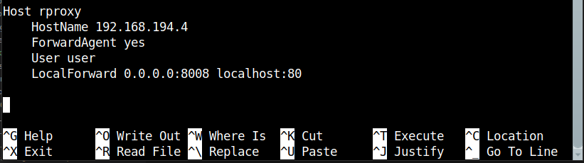

# 1. Reverse proxy

## 1.1 Introduction et choix d’un reverse proxy

!!! info Informations
    Dans une configuration de production, on ne fournit pas l’accès à un serveur d’application web dynamique directement mais par l’intermédiaire d’un vrai serveur web, comme nginx ou apache. Il y a plusieurs raisons à cela, en autres:

    - Un serveur web est plus efficace pour servir le contenu statique (html, css, js…) qu’un serveur d’application python (comme dans le cas de Synapse) ;
    - Les serveurs d’application ne gère généralement pas le chiffrement avec TLS ;
    - Un vrai serveur web permet de faire de l’hébergement mutualisé, c’est à dire servir plusieurs site différents en fonction de l’URL qui est utilisée pour y accéder.

    La technique utilisée est celle du Reverse Proxy. Comme son nom l’indique, il s’agit de faire un proxy inversé. Dans le cas des serveurs proxy que vous connaissez, il s’agit d’un serveur unique que le navigateur utilise pour accéder à l’ensemble du web.

    Dans le cas d’un reverse proxy, ce dernier agit comme un aiguilleur qui, en fonction de la requête d’un client, va rediriger celle-ci vers un serveur capable de la traiter. Il est généralement le seul à être accessible par un navigateur et est le seul à pouvoir se connecter aux différents serveurs capable de traiter les requêtes.

    Il agit donc comme un aiguilleur mais également comme un élément de sécurité qui va contrôler l’accès aux serveurs qui traitent réellement la requête.

!!! info Informations : Quelques reverse proxy
    1. HAProxy
    2. NGINX
    3. Cache HTTP Varnish
    4. Træfɪk
    5. Serveur proxy Squid
    6. Serveur HTTP Apache

!!! tip Notre choix : NGINX

    `NGINX`, un serveur HTTP et proxy inverse gratuit, open-source, hautes performances et très populaire. Il fonctionne également comme un serveur proxy IMAP/POP3. <span style="color:#2C7873;font-weight:700;"> NGINX est bien connu pour ses hautes performances, sa stabilité, son riche ensemble de fonctionnalités, sa configuration simple et flexible et sa faible consommation de ressources (particulièrement faible encombrement mémoire).</span>

    Tout comme HAProxy, NGINX a une architecture événementielle, il n’a donc aucun problème à gérer des dizaines de milliers de connexions simultanées, car il utilise le protocole PROXY de HAProxy.

    NGINX prend en charge le proxy inverse accéléré avec mise en cache à l'aide du module ngx_http_proxy_module, qui permet de transmettre des requêtes à un autre serveur via des protocoles autres que HTTP, tels que FastCGI, uwsgi, SCGI et memcached.

    Surtout, il prend en charge l'équilibrage de charge et la tolérance aux pannes, qui sont des aspects vitaux des systèmes informatiques distribués à grande échelle. Le module ngx_http_upstream_module permet de définir des groupes de serveurs backend pour distribuer les requêtes provenant des clients. Cela rend vos applications plus robustes, disponibles et fiables, hautement évolutives, avec un temps de réponse et un débit. De plus, en ce qui concerne la sécurité, il prend en charge la terminaison SSL/TLS et de nombreuses autres fonctionnalités de sécurité.

    !!! info Source
        https://fr.linux-console.net/?p=1291#gsc.tab=0


## 1.2 Installation d’un reverse proxy

!!! info Informations
    Pour installer le reverse proxy que vous avez choisi, vous devrez créer une nouvelle machine virtuelle. 
    
    !!! info Paramètres importants pour cette machine virtuelle
        nom : rproxy
        adresse ip : 192.168.194.4

    Elle devra, comme la machine virtuelle matrix être accessible en SSH.

!!! info Rappel
    Revoir la procedure `créer et gérer machines virtuelles` pour plus de détails

```bash
(virtu)utilisateur@acajou12:~$ source /home/public/vm/vm.env
```

```bash
(virtu)utilisateur@acajou12:~$ vmiut creer rproxy
```

```bash
(virtu)utilisateur@acajou12:~$ vmiut demarrer rproxy
```

```bash
(virtu)utilisateur@acajou12:~$ vmiut arreter rproxy
```

```bash
(phy)utilisateur@hevea19:~$ ssh -X virt
```

```bash
(virtu)utilisateur@acajou12:~$ vmiut demarrer rproxy
```


```bash
(virtu)utilisateur@acajou12:~$ vmiut console rproxy

```
!!! info Informations 
    ```console
    debian login : root
    Password : root
    ```
        OU
    ```console
    debian login : user
    Password : user
    ```

```bash
user@debian vm$ ip addr show
```

```bash
user@debian vm$ ip route
```


```bash
(virtu)utilisateur@acajou12:~$ ssh user@192.168.194.26
```

```bash
(virtu)utilisateur@acajou12:~$ vmiut console rproxy
```

```bash
root@vm#  ifdown enp0s3
```

```bash
root@vm# nano /etc/network/interfaces
```


Redémarrer l'interface reseau

```bash
root@vm# ifup enp0s3
```

```bash
root@vm# reboot
```

!!! success Verification : connexion en ssh sur rproxy
    ```bash
    (virtu)utilisateur@acajou12:~$ ssh root@192.168.194.4
    ```

```bash
root@vm# nano /etc/environment
```


```bash
root@vm# reboot
```

```bash
(vm)root@debian: apt update && apt full-upgrade
```


```bash
(phy)utilisateur@hevea19:~$ nano /.ssh/config
```




