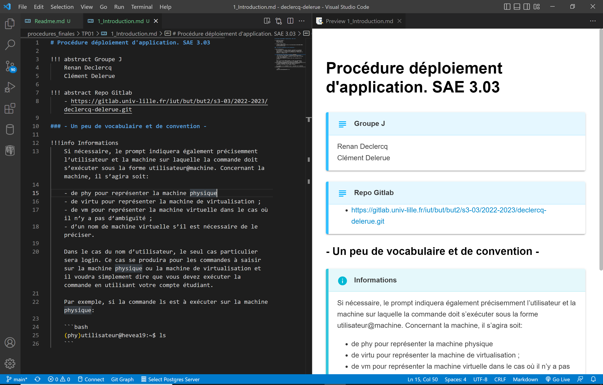

**SAE déploiement d'une application**

**Groupe J : Declercq Renan - Delerue Clement**

Nous utilisons les admonitions markdown, pour les visualiser il faut télécharger une extension tel que **Markdown all in one** ou encore **Markdown Preview Enhanced**.

Nous comptions convertir les documents markdown en HTML , ainsi il n'y aurait pas eu de soucis de comptabilité mais nous avons vu la dernière consigne qui consiste à ne pas fournir de document HTML dans le dossier à rendre. 

Voici un exemple du rendu :

