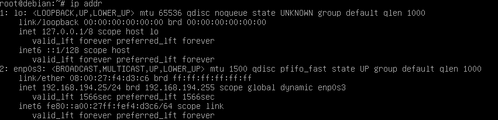
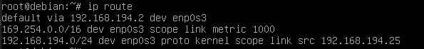
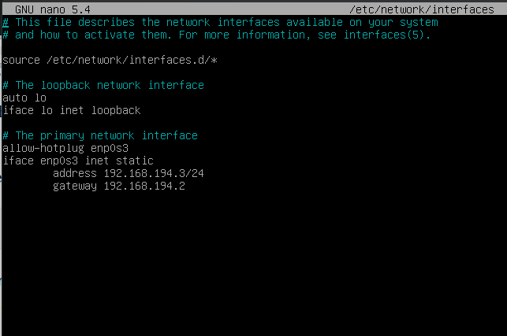
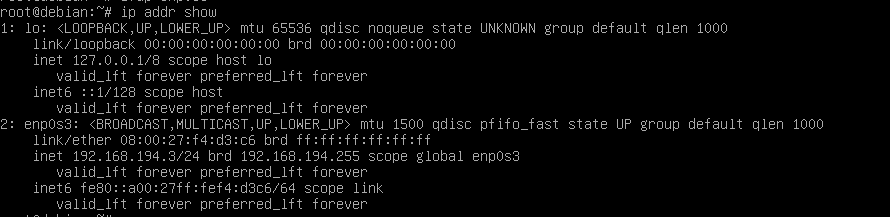
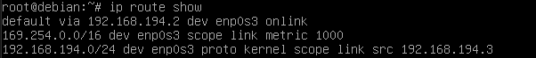

## - Creer et gérer des machines virtuelles -

!!! Info Informations
    Vous devez exécuter toutes les commandes de cette section sur votre machine de virtualisation.

Executer le script vmiut :

```bash
(virtu)utilisateur@acajou12:~$ source /home/public/vm/vm.env
```

!!! warning Attention
    Vous devrez utiliser la commande `source` dans chaque nouveau shell

!!! info Informations
    Pour manipuler les machines virtuelles utilisez vmiut (cf 'vmiut --help').
    Les machines virtuelles seront stockées sur acajou12 dans /usr/local/virtual_machine/infoetu/utilisateur.
    


### Création d’une machine virtuelle 

!!! note Création de la machine virtuelle matrix
    ```bash
    (virtu)utilisateur@acajou12:~$ vmiut creer matrix
    ```

    ```bash
    Virtual machine 'matrix' is created and registered.
    UUID: 5c1daebf-bb94-4988-add4-11052b12e2e8
    Settings file: '/usr/local/virtual_machine/infoetu/utilisateur/matrix/matrix.vbox'
    0%...10%...20%...30%...40%...50%...60%...70%...80%...90%...100%
    Clone medium created in format 'VMDK'. UUID: 47653a3f-bda0-41a0-8eb2-6ae1429665e1
    # Paramètres vmiut
    MACHINE=matrix
    VBOXES=/usr/local/virtual_machine/infoetu/utilisateur
    RESEAU=vmnet8
    MEMOIRE=1024
    VRDEPORT=5000-5050
    MODELE=/home/public/vm/disque-5Go-bullseye.vdi
    HOST=acajou12

    # Paramètres VirtualBox
    name=matrix
    UUID=5c1daebf-bb94-4988-add4-11052b12e2e8
    path=/usr/local/virtual_machine/infoetu/utilisateur/matrix
    memory=1024
    etat=poweroff
    vrdeport=-1
    mac=08:00:27:f4:d3:c6
    ```

!!! note Lister les machines virtuelles existantes
    ```bash
    (virtu)utilisateur@acajou12:~$ vmiut lister
    ```

    ```bash
    "Win10" {dc87e177-eb41-457c-9fcc-84c0ca9f38ca}
    "matrix" {5c1daebf-bb94-4988-add4-11052b12e2e8}
    ```

!!! danger Problème possible
    Si, au cours de la SAÉ, le résultat de la commande vmiut lister ressemble à : 
    "`<inaccessible>`" {903447fe-d6ca-4f2f-9272-3f465a026540}

    alors soit:
    - Vous ne vous trouvez pas sur la machine de virtualisation 
    - Les fichiers de votre machine virtuelle ont été effacés

### Démarrer la machine virtuelle

!!! note Démarrer la machine virtuelle matrix
    ```bash
    (virtu)utilisateur@acajou12:~$ vmiut demarrer matrix
    ```

    ```bash
    Waiting for VM "matrix" to power on...
    VM "matrix" has been successfully started.
    ```

### 2.3.3 Arrêt et suppression de la machine virtuelle

!!! danger Arreter la machine virtuelle matrix
    **A faire à la fin de chaque séance**

    ```bash
    (virtu)utilisateur@acajou12:~$ vmiut arreter matrix
    ```

!!! warning Supprimer la machine virtuelle matrix
    **A n'utiliser que si vous voulez supprimer définitivement votre machine virtuelle**
    ```bash
    (virtu)utilisateur@acajou12:~$ vmiut supprimer matrix
    ```

!!! tip Astuce
    Si vous souhaitez les sauvegarder, vous pouvez copier le répertoire /usr/local/virtual_machine/login/`NOMDEMACHNE`

### 2.3.4 Obtenir des informations sur la machine virtuelle

!!! note Afficher informations sur la machine virtuelle matrix
    ```bash
    (virtu)utilisateur@acajou12:~$ vmiut info matrix
    ```

    ```bash
    # Paramètres vmiut
    MACHINE=matrix
    VBOXES=/usr/local/virtual_machine/infoetu/utilisateur
    RESEAU=vmnet8
    MEMOIRE=1024
    VRDEPORT=5000-5050
    MODELE=/home/public/vm/disque-5Go-bullseye.vdi
    HOST=acajou12

    # Paramètres VirtualBox
    name=matrix
    UUID=5c1daebf-bb94-4988-add4-11052b12e2e8
    path=/usr/local/virtual_machine/infoetu/utilisateur/matrix
    memory=1024
    etat=running
    vrdeport=5000
    mac=08:00:27:f4:d3:c6
    ip-possible=192.168.194.25
    ```

!!! info Informations
    Si :
    ```bash
    ip-possible = ""
    ```
    Il faut attendre quelques minutes et relancer la commande 

### Quelques informations sur le réseau et la VM

|                     Machine                      |                        Adresse |
| :----------------------------------------------: | -----------------------------: |
|            Machine de virtualisation             |                  192.168.194.1 |
|                   Routeur, DNS                   |                  192.168.194.2 |
| Adresses dynamiques (attribuées automatiquement) | 192.168.194.25-192.168.194.128 |

!!!info Informations
    La machine virtuelle a été créée à partir d’un modèle.

    Voici les caractéristiques du modèle:

    - Distribution: Debian GNU/Linux 11 (bullseye)
    - Utilisateur standard: user, mot de passe: user
    - Administrateur: root, mot de passe: root
    - Empreinte de la clé SSH: SHA256:SUHhxVJVZFiBQ6/koNbZfA9reKHyzIrvPgJvOEJ8zuE

### 2.3.6 Utilisation de la machine virtuelle

!!! info Informations
    Utilisation d'une machine virtuelle :
    - Solution 1 : Utiliser une console virtuelle: simule un clavier et un écran qui serait connectés physiquement à la machine virtuelle
    - Solution 2 : Se connecter en SSH.

#### Solution 1 : Console virtuelle

!!! note Se connecter à la machine virtuelle matrix en utilisant une console
    ```bash
    (virtu)utilisateur@acajou12:~$ vmiut console matrix
    ```

    !!! bug Failed to open display
        ```bash
        ERROR: Failed to open display:
        ```

        !!! info Informations
            Ceci est du au fait que la console virtuelle est une application graphique mais que vous êtes connecté à distance sur la machine de virtualisation. L’application graphique ne peut donc pas afficher sa fenêtre.

    !!!tip Solution
        Pour palier à ce problème, nous allons utiliser une fonctionnalité de SSH qui permet de rediriger une application graphique par la connexion SSH.

        !!! note Arreter matrix
            ```bash
            (virtu)utilisateur@acajou12:~$ vmiut arreter matrix
            ```

        !!! note Revenir sur la machine physique
            
            ```bash
            (virtu)utilisateur@acajou12:~$ CTRL + D 
            ```

        !!! note Se connecter à la machine de virtualisation en ssh avec l'option -X
            ```bash
            (phy)utilisateur@hevea19:~$ ssh -X acajou12.iutinfo.fr
            ```

    !!! info Informations
        l’option -X de SSH permet d’effectuer la redirection graphique. Vous pouvez maintenant retenter la commande vmiut console matrix.

    !!!warning Ne pas oublier
        ```bash
        (virtu)utilisateur@acajou12:~$ source /home/public/vm/vm.env
        ```

    !!! success Demarrer matrix puis connecter vous à matrix en console
        ```bash
        (virtu)utilisateur@acajou12:~$ vmiut demarrer matrix
        ```

        ```bash
        (virtu)utilisateur@acajou12:~$ vmiut console matrix
        ```

!!! note Se connecter en tant que root
    ```bash
    vm$ debian login : root
    password : root
    ```

    !!! info Informations
        - Si vous voulez vous connecter en tant que root :
        login : root
        mot de passe : root
        - Si vous voulez vous connecter en tant que user :
        login : user
        mot de passe : user

!!! note Afficher les informations ip
    ```bash
    root@debian:# ip addr show
    ```

    !!! info Informations
        On remarque que l'adresse IP de enp0s3 = 192.168.194.25/24

    

!!! note Afficher les informations sur les routes
    ```bash
    root@debian:# ip route
    ```

    

#### 2.3.6.2 Solution 2 : Connexion SSH

!!! note Se connecter à matrix en SSH grâce à l'adresse IP 
    ```bash
    (virtu)utilisateur@acajou12:~$ ssh user@192.168.194.25
    ```

    ```bash
    The authenticity of host '192.168.194.25 (192.168.194.25)' can't be established.
    ECDSA key fingerprint is SHA256:SUHhxVJVZFiBQ6/koNbZfA9reKHyzIrvPgJvOEJ8zuE.
    Are you sure you want to continue connecting (yes/no/[fingerprint])? yes
    Warning: Permanently added '192.168.194.25' (ECDSA) to the list of known hosts.

    user@192.168.194.25's password: user
    ```

### Changement de la configuration réseau

!!! info Informations
    Votre machine virtuelle sera un serveur, hébergeant un service. Il est préférable qu’elle ait donc toujours la même adresse IP. Nous allons choisir l’adresse 192.168.194.3

!!! note Changer l'adresse IP de la machine virtuelle matrix
    ```bash
    (virtu)utilisateur@acajou12:~$ vmiut console matrix
    ```

    ```bash
    root@vm#  ifdown enp0s3
    ```

    

    !!!note Modifier les fichier interfaces et resolv.conf
        Modifiez les fichiers /etc/network/interfaces et /etc/resolv.conf de façon à ce que la VM ait l’adresse statique 192.168.194.3 et qu’elle utilise le routeur 192.168.194.2 et serveur DNS 192.168.194.2.
        

        ```bash
        root@vm# nano /etc/network/interfaces
        ```

        

        !!! Info Informations Le fichier resolv.conv est déjà bien configuré
            DNS (nameserver):

            ```bash
            root@vm# nano /etc/resolv.conf
            ```

            

        Redémarrer l'interface reseau

        ```bash
        root@vm# ifup enp0s3
        ```

    !!! Success On obtient cette nouvelle adresse IP statique
        

        

!!! tip Lien de la prochaine procédure

    [Configurer et mettre à jour la machine virtuelle](./4_configurer_et_maj_la_vm.md)