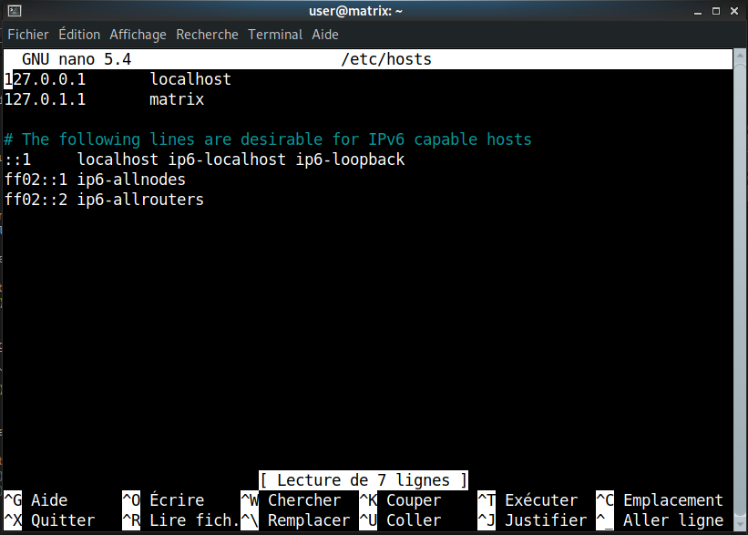

## - Dernière configurations sur la VM -

### Changement du nom de machine

!!! note Modification du fichier hostname : ~~debian~~ 	-->  matrix

    !!! warning Remarque : Utiliser l'utilisateur root !

        ```bash
        (vm)user@debian:~# su -l 
        ```
            Mot de passe = root


    ```bash
    (vm)root@debian:~# nano /etc/hostname
    ```

    

!!! note Modification du fichier hosts (Domain name system) :  ~~debian~~ -->  matrix

    ```bash
    (vm)root@matrix:~# nano /etc/hosts
    ```

    


!!! success Redémarrer matrix et tester les changements avec ping
    ```bash
    (vm)root@matrix:~# reboot
    ```

    ```bash
    (vm)root@matrix:~# ping matrix
    ```

### 1.2 Installation et configuration de la commande `sudo`

!!! note Installer sudo
    ```bash
    (vm)root@matrix:~# apt-get install sudo
    ```

!!! note Ajouter les permissions sudo à user
    ```bash
    (vm)root@matrix:~# usermod -aG sudo user
    ```

!!! success Verification : User est bien ajouté au groupe sudo

    ```bash
    (vm)user@matrix:~# groups
    ```

### 1.3 Configuration de la synchronisation d’horloge

```bash
(vm)user@matrix:~# date
lun. 21 nov. 2022 15:18:38 CET
```

```bash
(virtu)utilisateur@acajou12:~$ date
lun. 21 nov. 2022 14:18:38 CET
```

```bash
(phy)utilisateur@hevea19:~$  date
lun. 21 nov. 2022 14:18:38 CET
```

!!! note Modification du fichier timesyncd.conf
    Décommenter les lignes en-dessous de [Time] et ajouter `NTP=ntp.univ-lille.fr`

    ```bash
    (vm)root@matrix:~# nano /etc/systemd/timesyncd.conf
    ```

    

    ```bash
    (vm)root@matrix:~# timedatectl set-ntp true
    (vm)root@matrix:~# timedatectl status
    (vm)root@matrix:~# systemctl restart systemd-timesyncd.service
    ```


!!! info Informations

    Il faut attendre quelques secondes pour afficher la bonne heure au lancement de la machine virtuelle

!!! tip Lien de la prochaine procédure

    [Installation et configuration d'un serveur de base de données](./2_installation_et_config_serveur_bdd.md)