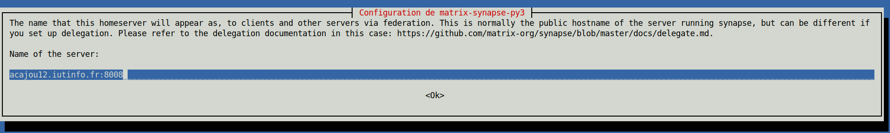
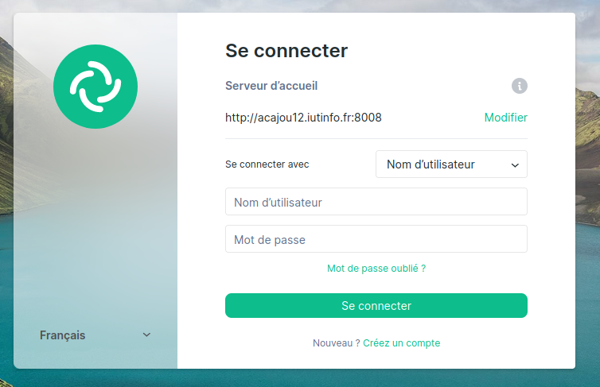
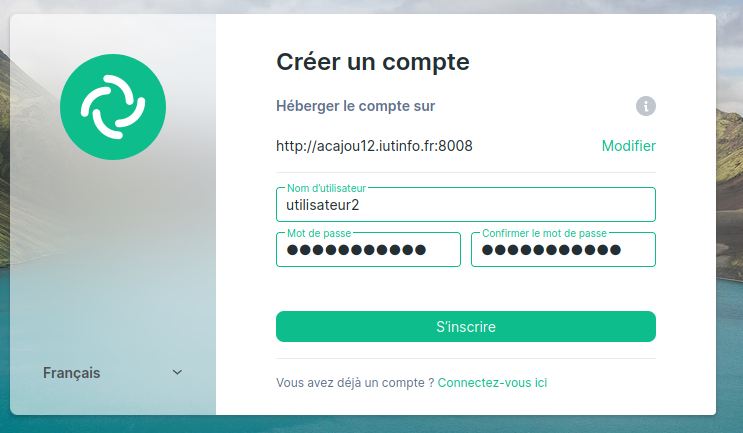

## - Installation de Synapse -

### Installation du paquet sous Debian

!!! note Installation de synapse

    ```bash 
    root@vm# apt install -y lsb-release wget apt-transport-https
    root@vm# wget -qO /usr/share/keyrings/matrix-org-archive-keyring.gpg https://packages.matrix.org/debian/matrix-org-archive-keyring.gpg
    root@vm# echo "deb [signed-by=/usr/share/keyrings/matrix-org-archive-keyring.gpg] https://packages.matrix.org/debian/ $(lsb_release -cs) main" | tee /etc/apt/sources.list.d/matrix-org.list
    root@vm# apt-get update -y
    root@vm# apt-get install matrix-synapse-py3 -y
    ```

    

### 4.2.2 Paramétrage spécifique pour une instance dans un réseau privé

!!! info Informations
    Notre installation est peu commune car votre serveur n’est pas accessible depuis internet. En production réelle, on voudrait qu’il le soit. Les paramètres par défaut de Synapse considèrent donc que votre serveur est accessible de l’extérieur et qu’il ne cherche pas à contacter des éléments situés sur un réseau privé. En particulier, on ne veut pas que notre serveur contacte d’autres serveurs pour obtenir des clés publiques de signatures.


!!! note Modification du fichier homeserver.yaml
    
    ```bash 
    root@vm# nano /etc/matrix-synapse/homeserver.yaml
    ```
    Remplacer les informations de `trusted_key_servers` comme ci-dessous
    ```yaml
        trusted_key_servers : []
    ```

### 4.2.3 Utilisation d’une base Postgres

!!! warning Attention
    
    Lors de la séance précédente, nous avons créé une base de données matrix avec les options de création par défaut. Ces options ne conviennent pas à Synapse et il refusera de démarrer si vous ne changez rien à votre base de données.

    **Il faut recréer la base de données**

!!! note Supprimer la base de donnée matrix créee précédemment
    
    ```bash 
    root@vm# dropdb -h localhost -U matrix matrix
    ```


!!! note Modification du fichier homeserver.yaml
    
    ```bash 
    root@vm# nano /etc/matrix-synapse/homeserver.yaml
    ```

    ```yaml
    database:
    name: psycopg2
    args:
        user: synapse_user
        password: synapse_user
        database: synapse
        host: localhost
        cp_min: 5
        cp_max: 10
    ```
    !!! warning
        Attention à l'indentation du fichier yaml
        Erreur possible si l'indentation (de 2 espaces pour les arguments) n'est pas respectée

!!! note Recréation d'un utilisateur et d'une base de données
    
    ```bash 
    root@vm# su - postgres
    ```

    ```bash 
    postgres@vm# createuser -d -r -l -P synapse_user 
    ```

    ```bash 
    postgres@vm# createdb --encoding=UTF8 --locale=C --template=template0 --owner=synapse_user synapse
    ```

### 4.2.4 Création d’utilisateurs matrix

!!! info Informations
    Pour créer un utilisateur sur votre serveur, vous devez utiliser le script (installé avec le serveur Synapse) register_new_matrix_user.

!!! note Modification du fichier homeserver.yaml

    ```bash 
    root@vm# nano /etc/matrix-synapse/homeserver.yaml
    ```

    Ajouter la ligne :
    ```yaml
    registration_shared_secret: "renan"
    ```

    !!! info Informations
        Remplacer `renan` par le nom de l'utilisateur

    ```bash 
    root@vm# reboot
    ```


    ```bash 
    root@vm# register_new_matrix_user -u clement -p clement -a -c homeserver.yaml 
    root@vm# register_new_matrix_user -u renan -p renan -a -c homeserver.yaml
    ```

### Connexion à votre serveur Matrix


!!! note On ajoute dans le alias `vm`
    
    ```bash
    (phy)utilisateur@hevea19:~$ nano .ssh/config
    ```
        LocalForward 0.0.0.0:8080 192.168.194.3:8080
        LocalForward 0.0.0.0:8008 localhost:8008

!!!info Informations : Ouvrez ce lien sur google
    http://tp.iutinfo.fr:8888/

!!! info Notice connexion
    1 - `Je comprends les risques et souhaite continuer `
    2 - `Se connecter`
    3 - Modifier serveur d'accueil : `http://acajou12.iutinfo.fr:8008`
    4 - Configuration des clés : impossible de configurer les clés : `annuler`

    


!!! info Créer un salon et invité un membre 
    1 - Créer un nouveau salon privé 
    2 - Inviter : @clement:acajou12.iutinfo.fr:8008

### Activation de l’enregistrement des utilisateurs

!!! info Activer l'enregistrement
    ```bash 
    root@vm# nano /etc/matrix-synapse/homeserver.yaml
    ```

    ```yaml
    enable_registration_without_verification : true
    enable_registration : true
    ```

    !!! success On peut maintenant créer un nouvel utilisateur
        `Créez un compte`
        
        Configuration des clés : `annuler`

### Communiquer avec un camarade sur un pc différent

!!! tip Astuce
    Il suffit de se connecter au serveur d'accueil d'une personne pour communiquer directement dans son salon

!!! tip Lien de la prochaine procédure

    !!! info Informations
        On passe au TP n°4
    
    [Element web](../TP04/1_element_web.md)