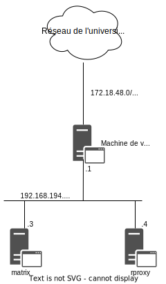
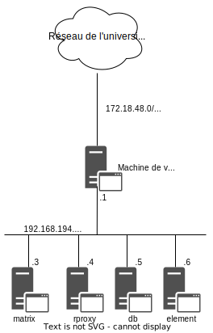
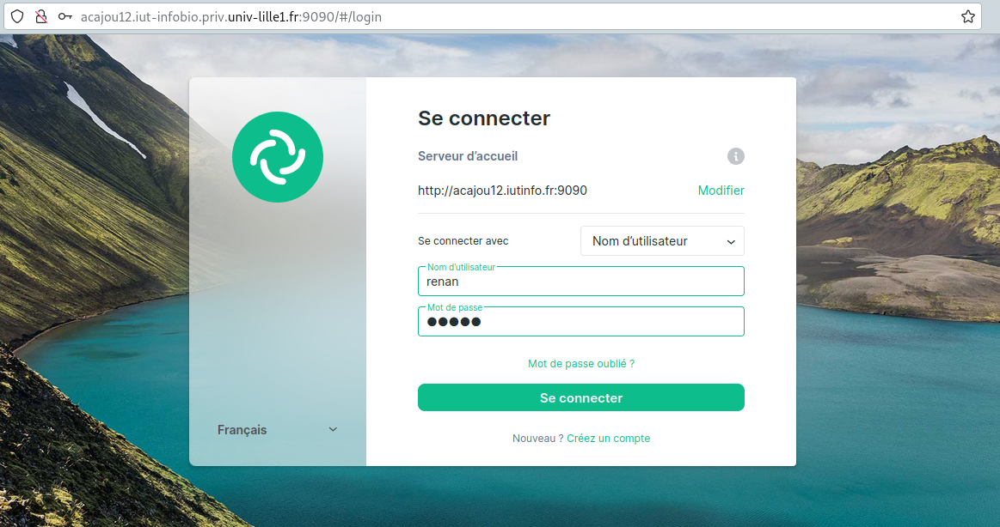

##  - Architecture finale -

!!! info Informations

    À la fin du sujet n°4, vous devez avoir un déploiement qui peut s’illustrer par la figure suivante:

    

    Vos services s’exécutent sur une seule machine virtuelle. Seul le reverse proxy s’exécute sur une machine virtuelle différente.

    !!!warning Problèmes
        Avoir tous les services sur la même machine peut poser un certain nombre de problèmes dont par exemple:

        - **compatibilité de dépendances** : même si nous n’avons pas eu ce problème, certaines dépendances peuvent être incompatibles entre différents services, par exemple si deux services ont besoin d’une même dépendance, mais de versions différentes ;
        - **point unique de défaillance** : si la machine virtuelle hébergeant tous les services a un problème (logiciel, matériel…), tous les services sont rendus indisponibles. Une fois la défaillance réparée, il faudra restaurer tous les services, ce qui prends du temps ;
        - **sécurité** : si un des services possède une faille de sécurité et qu’elle est exploitée, ce sont tous les services qui sont mis en péril par l’exploitation de cette faille.

        Le troisième point est probablement le plus important et la raison principale qui motive le changement d’architecture que nous allons opérer dans ce sujet.


###  Description de l'architecture finale

!!! info Informations
    Pour répondre en partie aux problèmes cités à la section précédente, vous allez maintenant mettre en place l’architecture finale suivante:

    

    Dans cette architecture, l’accès à vos services (Synapse et Element) depuis le réseau de l’université sera assuré uniquement via le reverse proxy.


!!! abstract Contraintes
    1 - Pour toutes les machines virtuelles, vous devez appliquer les configurations minimales suivantes : 
    - proxy http
    - synchronisation du temps avec NTP
    - déploiement de vos clés SSH
    - configuration correcte de sudo
    - configuration correcte du nom d’hôte et du fichier de résolution DNS local : toutes les machines doivent pouvoir connaître l’adresse de toutes les autres à partir de leur nom 

    2 - La machine matrix doit être re-créée depuis une machine vierge. Il ne doit plus y avoir que le service Synapse qui s’exécute. La valeur de configuration de son server_name sera virtu.iutinfo.fr:9090 (en remplaçant virtu par le nom de votre machine de virtualisation) 

    3 - Synapse doit maintenant accepter les connexions entrantes depuis le réseaux 192.168.194.0/24 uniquement 

    4 - Votre serveur postgres doit accepter les connexions entrante depuis la machine matrix. Synapse doit utiliser la base de données postgres située sur ce serveur 
    
    5 - Le reverse proxy doit ête accessible via la machine de virtualisation sur le port 9090 

    6 - Accéder au reverse proxy par l’URL http://virtu.iutinfo.fr:9090 doit servir l’application Synapse (en remplaçant virtu par le nom de votre machine de virtualisation) 

    7 - Accéder au reverse proxy par l’UTL http://virtu.iut-infobio.priv.univ-lille1.fr:9090 doit servir l’application Element (toujours en remplaçant virtu par le nom de votre machine de virtualisation).

### Création et configurations des machines virtuelles

!!! info Informations

    Nous allons donc supprimer la machine virtuelle matrix pour la recrée à partir d'une vm vierge. Cependant nous pouvons garder rproxy , nous ferons les changements adéquates par la suite.

!!! info Informations
    Voici l'ordre de création et configuration des machines :
    
    1 - [db](./2_db.md)
    2 - [matrix](./3_matrix.md)
    3 - [element](./4_element.md)
    4 - [rproxy](./5_reverse_proxy_final.md) (Ajout des dernières modifications à la machine rproxy déjà existante)

    Fichier config : [Alias](./alias.md) 

    !!! info Informations

        Cliquez sur les liens des machines virtuelles et du fichier alias ci-dessus pour consulter les procédures concernant l'architecture finale 

!!! Success Conclusion : Vérification

    Allumez toutes les machines virtuelles avec ``vmiut demarrer`` :
    - db
    - matrix
    - element
    - rproxy

    Puis connectez vous à la machine virtuelle rproxy en ssh

    ```bash
    (virtu)utilisateur@acajou12:~$ ssh rproxy
    ```

    Vous pouvez désormais aller aux adresses suivantes sur votre navigateur préféré :
           
        http://virtu.iutinfo.fr:9090 : synapse
          
        http://virtu.iut-infobio.priv.univ-lille1.fr:9090 : client element
    
    

    Modifier le serveur d'accueil : ``http://virtu.iutinfo.fr:9090``

    Puis accéder à votre compte en entrant votre nom d'utilisateur et votre mot de passe ou si vous n'avez pas de compte, vous pouvez toujours en créer un via ``Créez un compte``

    !!! info Informations

        Remplacer virtu par votre machine de virtualisation, par exemple dans notre cas, nous utilions acajou12 :

            http://acajou12.iut-infobio.priv.univ-lille1.fr:9090
