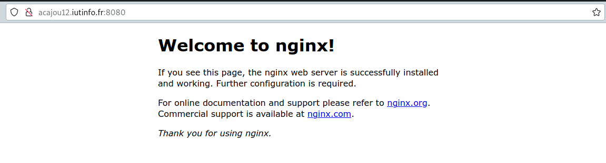

# Procédure déploiement d'application. SAE 3.03

!!! abstract Groupe J
    Renan Declercq
    Clément Delerue

!!! abstract Repo Gitlab
    - <https://gitlab.univ-lille.fr/utilisateur/sae-deploiement.git>

## 1. Table des matières

# 2. TP01

## 2.1 Un peu de vocabulaire et de convention

!!!info
    Si nécessaire, le prompt indiquera également précisemment l’utilisateur et la machine sur laquelle la commande doit s’exécuter sous la forme utilisateur@machine. Concernant la machine, il s’agira soit:

    - de phy pour représenter la machine physique
    - de virtu pour représenter la machine de virtualisation ;
    - de vm pour représenter la machine virtuelle dans le cas où il n’y a pas d’ambiguïté ;
    - d’un nom de machine virtuelle s’il est nécessaire de le préciser.

    Dans le cas du nom d’utilisateur, le seul cas particulier sera login. Ce cas se produira pour les commandes à saisir sur la machine physique ou la machine de virtualisation et il voudra simplement dire que vous devez exécuter la commande en utilisant votre compte étudiant.

    Par exemple, si la commande ls est à exécuter sur la machine physique:

    ```bash
    (phy)utilisateur@hevea19:~$ ls
    ```

## 2.2 Connexion à distance

### 2.2.1 Première connexion à la machine de virtualisation

!!!info
    La machine physique = hevea19
    La machine de virtualisation = acajou12

| Fingerprint                                              |       Machine       |      Algo |
| :------------------------------------------------------- | :-----------------: | --------: |
| 3072  SHA256:1pXDryxLNlVsKPTkEIAona46yIf/peCZ88qTFbxvHH4 | acajou12.iutinfo.fr |     (RSA) |
| 256  SHA256:CrB3/QEaXDvn0Qp1dQapmYSejef1Zh45oEl4Ozuk1hU  | acajou12.iutinfo.fr |   (ECDSA) |
| 256  SHA256:4QYLsyCTuLFa2QCk+jqi4MBPuqpO4yD+FULHAcXj7lU  | acajou12.iutinfo.fr | (ED25519) |

```bash
(phy)utilisateur@hevea19:~$ ssh acajou12.iutinfo.fr
```

Effectuer les validations :

```bash
The authenticity of host 'acajou12.iutinfo.fr (172.18.49.39)' can't be established.
ECDSA key fingerprint is SHA256:CrB3/QEaXDvn0Qp1dQapmYSejef1Zh45oEl4Ozuk1hU.
Are you sure you want to continue connecting (yes/no/[fingerprint])?
```

Votre client SSH ajoutera alors le serveur dans le fichier $HOME/.ssh/known_hosts pour indiquer que vous lui faites confiance.

```bash
yes
```

```bash
utilisateur@acajou12.iutinfo.fr's password: [Entrer le mdp]
```

```bash
Connection closed by 172.18.49.39 port 22
```

!!! info
    Devoir saisir son mot de passe à chaque connexion peut vite s’avérer pénible, surtout si on doit le faire souvent. SSH permet de s’authentifier autrement qu’avec un simple mot de passe.

    Le principe d’utilisation pour l’authentification SSH est le suivant: vous donnez au serveur SSH votre clé publique et, au moment de la connexion, un challenge cryptographique permettra au serveur de vérifier que vous possédez bien la clé privée associée à la clé publique sans que votre clé privée ne soit jamais diffusée en dehors de votre machine.

### 2.2.2 Faciliter la connexion

- Fabriquer une paire de clés
  La commande demande :

  - un nom de fichier : vous pouvez laisser le nom de fichier par défaut. Notez le. Il est bon de le connaître
  - une passphrase: c’est un mot de passe qui permet de chiffrer le fichier contenant votre clé privé. Il est très important d’utiliser un mot de passe pertinent. Ainsi, si on vous vole le fichier, le voleur ne pourra pas se servir de votre clé.

```bash
(phy)utilisateur@hevea19:~$ ssh-keygen
```

```bash
Generating public/private rsa key pair.
Enter file in which to save the key (/home/infoetu/utilisateur/.ssh/id_rsa):
```

Ici, j'entre la passphrase choisie (voir Notes smartphone)

```bash
Enter passphrase (empty for no passphrase):
Enter same passphrase again: 
```

```bash
Your identification has been saved in /home/infoetu/utilisateur/.ssh/id_rsa
Your public key has been saved in /home/infoetu/utilisateur/.ssh/id_rsa.pub
The key fingerprint is:
SHA256:zw56Ut+qEh0QaWg42E7gAJZHNYzztuvGPn0QbnH5Frc utilisateur@hevea19
The key's randomart image is:
+---[RSA 3072]----+
|==oo++.o         |
|=.=+o.=          |
| +.oo. .  .      |
|  .  o o.o . .   |
|    . o.S.. o .  |
|     ..+oo o E   |
|    . +oo.+.     |
|     =oo.+. .    |
|    +oo+o.o.     |
+----[SHA256]-----+
```

- Transmettre la clé publique au serveur.

    Quand un utilisateur tente de se connecter à un serveur SSH, celui-ci consulte le fichier $HOME/.ssh/authorized_keys3 à la recherche de clés publiques autorisées à se connecter pour l’utilisateur

    Ce fichier, dont un exemple est donné ci-dessous, est constitué d’une clé publique par ligne.

        ssh-rsa AAAAB3NzaC1 [...] +1ts5x6ZXE= login@phys
        ssh-rsa AAAAB3NzaC1 [...] o/6cLqTmM8= commentaire
        ssh-ed25519 AAAAC3NzaC1lZDI1NTE5AAAAIGHaJOp3Vx34PVVEt6ZzTii60Sd3Hl5CZTiqgx37f8hp user@machine

    !!!info
        Les deux premières lignes on été tronquée pour des raisons de lisibilité. Le format d’une ligne est

            [options] type-clé clé commentaire

  - Solution 1 : le faire manuellement

  - Solution 2 : utiliser la commande ssh-copy-id

        On utilisera les commandes sur la machine de virtualisation

        ```bash
        ssh acajou12.iutinfo.fr
        ```

        ```bash
        man ssh-copy-id
        ```

        ```bash
        ssh-copy-id -i ~/.ssh/id_rsa.pub utilisateur@acajou12
        ```

        ```bash
        /usr/bin/ssh-copy-id: INFO: Source of key(s) to be installed: "/home/infoetu/utilisateur/.ssh/id_rsa.pub"
        The authenticity of host 'acajou12 (172.18.49.39)' can't be established.
        ECDSA key fingerprint is SHA256:CrB3/QEaXDvn0Qp1dQapmYSejef1Zh45oEl4Ozuk1hU.
        Are you sure you want to continue connecting (yes/no/[fingerprint])? yes
        /usr/bin/ssh-copy-id: INFO: attempting to log in with the new key(s), to filter out any that are already installed
        /usr/bin/ssh-copy-id: INFO: 1 key(s) remain to be installed -- if you are prompted now it is to install the new keys
        utilisateur@acajou12's password: 

        Number of key(s) added: 1

        Now try logging into the machine, with:   "ssh 'utilisateur@acajou12'"
        and check to make sure that only the key(s) you wanted were added.
        ```

    - le client propose au serveur des identifiants de clé avec lesquels il peut s’authentifier (par défaut, la clé présente dans les fichiers id_dsa, id_ecdsa, id_ed25519 et id_rsa) ;
    - si la clé publique est présente dans le fichier authorized_keys, le serveur génère un challenge aléatoire et le transmet au client ;
    - le client renvoie une signature du challenge qu’il effectue avec sa clé privée ;
    - le serveur vérifie la signature à l’aide de la clé publique ;
    - le client est identifié, la connexion est autorisée.

    On reesaye la connexion à la machine de virtualisation :

    ```bash
    utilisateur@hevea19:~$ ssh acajou12.iutinfo.fr
    Linux acajou12 5.10.0-17-amd64 #1 SMP Debian 5.10.136-1 (2022-08-13) x86_64

    The programs included with the Debian GNU/Linux system are free software;
    the exact distribution terms for each program are described in the
    individual files in /usr/share/doc/*/copyright.

    Debian GNU/Linux comes with ABSOLUTELY NO WARRANTY, to the extent
    permitted by applicable law.
    Last login: Thu Nov 17 09:03:29 2022 from 172.18.49.100
    utilisateur@acajou12:~$ 
    ```

## 2.3 Creer et gérer des machines virtuelles

!!! warning Attention
    Vous devez exécuter toutes les commandes de cette section sur votre machine de virtualisation.

Executer le script vmiut :

```bash
(virtu)utilisateur@acajou12:~$ source /home/public/vm/vm.env
```

!!! warning Attention
    Vous devrez utiliser la commande `source` dans chaque nouveau shell

```bash
Pour manipuler les machines virtuelles utilisez vmiut (cf 'vmiut --help').

Les machines virtuelles seront stockées sur acajou12 dans /usr/local/virtual_machine/infoetu/utilisateur.
```


### 2.3.1 Création d’une machine virtuelle

```bash
(virtu)utilisateur@acajou12:~$ vmiut creer matrix
```

```bash
Virtual machine 'matrix' is created and registered.
UUID: 5c1daebf-bb94-4988-add4-11052b12e2e8
Settings file: '/usr/local/virtual_machine/infoetu/utilisateur/matrix/matrix.vbox'
0%...10%...20%...30%...40%...50%...60%...70%...80%...90%...100%
Clone medium created in format 'VMDK'. UUID: 47653a3f-bda0-41a0-8eb2-6ae1429665e1
# Paramètres vmiut
MACHINE=matrix
VBOXES=/usr/local/virtual_machine/infoetu/utilisateur
RESEAU=vmnet8
MEMOIRE=1024
VRDEPORT=5000-5050
MODELE=/home/public/vm/disque-5Go-bullseye.vdi
HOST=acajou12

# Paramètres VirtualBox
name=matrix
UUID=5c1daebf-bb94-4988-add4-11052b12e2e8
path=/usr/local/virtual_machine/infoetu/utilisateur/matrix
memory=1024
etat=poweroff
vrdeport=-1
mac=08:00:27:f4:d3:c6
```

```bash
(virtu)utilisateur@acajou12:~$ vmiut lister
```

```bash
"Win10" {dc87e177-eb41-457c-9fcc-84c0ca9f38ca}
"matrix" {5c1daebf-bb94-4988-add4-11052b12e2e8}
```

    Si, au cours de la SAÉ, le résultat de la commande vmiut lister ressemble à : 
    "<inaccessible>" {903447fe-d6ca-4f2f-9272-3f465a026540}

    alors soit:
        * Vous ne vous trouvez pas sur la machine de virtualisation ;
        * Les fichiers de votre machine virtuelle ont été effacés.

### 2.3.2 Démarrer la machine virtuelle

```bash
(virtu)utilisateur@acajou12:~$ vmiut demarrer matrix
```

```bash
Waiting for VM "matrix" to power on...
VM "matrix" has been successfully started.
```

### 2.3.3 Arrêt et suppression de la machine virtuelle

!!! danger A faire
     Arrêter la vm à la fin de chaque séance 

```bash
(virtu)utilisateur@acajou12:~$ vmiut arreter matrix
```

!!! warning Attention
     Ne pas utiliser si on ne veut pas la supprimer 

```bash
(virtu)utilisateur@acajou12:~$ vmiut supprimer matrix
```

!!! tip Astuce
    Si vous souhaitez les sauvegarder, vous pouvez copier le répertoire /usr/local/virtual_machine/login/NOMDEMACHNE

### 2.3.4 Obtenir des informations sur la machine virtuelle

```bash
(virtu)utilisateur@acajou12:~$ vmiut info matrix
```

```bash
# Paramètres vmiut
MACHINE=matrix
VBOXES=/usr/local/virtual_machine/infoetu/utilisateur
RESEAU=vmnet8
MEMOIRE=1024
VRDEPORT=5000-5050
MODELE=/home/public/vm/disque-5Go-bullseye.vdi
HOST=acajou12

# Paramètres VirtualBox
name=matrix
UUID=5c1daebf-bb94-4988-add4-11052b12e2e8
path=/usr/local/virtual_machine/infoetu/utilisateur/matrix
memory=1024
etat=running
vrdeport=5000
mac=08:00:27:f4:d3:c6
ip-possible=192.168.194.25
```

    Si ip-possible=
    -> Il faut attendre quelques minutes et relancer la commande 

### 2.3.5 Quelques informations sur le réseau et la VM

|                     Machine                      |                        Adresse |
| :----------------------------------------------: | -----------------------------: |
|            Machine de virtualisation             |                  192.168.194.1 |
|                   Routeur, DNS                   |                  192.168.194.2 |
| Adresses dynamiques (attribuées automatiquement) | 192.168.194.25-192.168.194.128 |

!!!info
    La machine virtuelle a été créée à partir d’un modèle.

    Voici les caractéristiques du modèle:

    Distribution: Debian GNU/Linux 11 (bullseye)
    Utilisateur standard: user, mot de passe: user
    Administrateur: root, mot de passe: root
    empreinte de la clé SSH: SHA256:SUHhxVJVZFiBQ6/koNbZfA9reKHyzIrvPgJvOEJ8zuE

### 2.3.6 Utilisation de la machine virtuelle

- Solution 1 : Utiliser une console virtuelle: simule un clavier et un écran qui serait connectés physiquement à la machine virtuelle
- Solution 2 : Se connecter en SSH.

#### 2.3.6.1 Solution 1 : Console virtuelle

```bash
(virtu)utilisateur@acajou12:~$ vmiut console matrix
```

```bash
ERROR: Failed to open display:
```

!!! info
    Ceci est du au fait que la console virtuelle est une application graphique mais que vous êtes connecté à distance sur la machine de virtualisation. L’application graphique ne peut donc pas afficher sa fenêtre.

!!!tip Solution
    Pour palier à ce problème, nous allons utiliser une fonctionnalité de SSH qui permet de rediriger une application graphique par la connexion SSH. Pour cela, déconnectez vous de la machine de virtualisation et reconnectez vous avec la commande suivante :

    ```bash
    (virtu)utilisateur@acajou12:~$ vmiut arreter matrix
    ```

    Sortir de la machine de virtualisation 
    ```bash
    (virtu)utilisateur@acajou12:~$ CTRL + D 
    ```


    ```bash
    (phy)utilisateur@hevea19:~$ ssh -X acajou12.iutinfo.fr
    ```

!!! info
    l’option -X de SSH permet d’effectuer la redirection graphique. Vous pouvez maintenant retenter la commande vmiut console matrix.

!!!warning Ne pas oublier
    ```bash
    (virtu)utilisateur@acajou12:~$ source /home/public/vm/vm.env
    ```

```bash
(virtu)utilisateur@acajou12:~$ vmiut demarrer matrix
```

```bash
(virtu)utilisateur@acajou12:~$ vmiut console matrix
```

Connectez vous en tant que root et utilisez les commandes ip addr show et ip route show pour constater que les paramètres de réseau correspondent bien à ce qui est attendu.

```bash
vm$ debian login : root
password : root
```

```bash
vm$ ip addr show
```


```bash
vm$ ip addr route
```


#### 2.3.6.2 Solution 2 : Connexion SSH

```bash
(virtu)utilisateur@acajou12:~$ ssh user@192.168.194.25
```

```bash
The authenticity of host '192.168.194.25 (192.168.194.25)' can't be established.
ECDSA key fingerprint is SHA256:SUHhxVJVZFiBQ6/koNbZfA9reKHyzIrvPgJvOEJ8zuE.
Are you sure you want to continue connecting (yes/no/[fingerprint])? yes
Warning: Permanently added '192.168.194.25' (ECDSA) to the list of known hosts.
user@192.168.194.25's password: user
```

### 2.3.7 Changement de la configuration réseau

Votre machine virtuelle sera un serveur, hébergeant un service. Il est préférable qu’elle ait donc toujours la même adresse IP. Nous allons choisir l’adresse 192.168.194.3

```bash
(virtu)utilisateur@acajou12:~$ CTRL + D
```

```bash
(virtu)utilisateur@acajou12:~$ vmiut console matrix
```

```bash
root@vm#  ifdown enp0s3
```


Modifiez les fichiers /etc/network/interfaces et /etc/resolv.conf de façon à ce que la VM ait l’adresse statique 192.168.194.3 et qu’elle utilise le routeur 192.168.194.2 et serveur DNS 192.168.194.2.

Adresse statique et routeur :

```bash
root@vm# nano /etc/network/interfaces
```


DNS (nameserver):

```bash
root@vm# nano /etc/resolv.conf
```


Redémarrer l'interface reseau

```bash
root@vm# ifup enp0s3
```


Utilisez la commande suivante pour redémarrer la machine virtuelle et vérifier que la configuration réseau est bien persistante

```bash
root@vm# reboot
```

## 2.4 Configurer et mettre à jour la machine virtuelle

### 2.4.1 Connexion root et SSH

Essayez de vous connecter à la machine virtuelle en SSH sur le compte root.

Quelle commande avez vous utilisée ?

    ```bash
    (virtu)utilisateur@acajou12:~$ ssh root@192.168.194.3
    ```

Que se passe-t’il ?

```bash
(virtu)utilisateur@acajou12:~$ ssh root@192.168.194.3
The authenticity of host '192.168.194.3 (192.168.194.3)' can't be established.
ECDSA key fingerprint is SHA256:SUHhxVJVZFiBQ6/koNbZfA9reKHyzIrvPgJvOEJ8zuE.
Are you sure you want to continue connecting (yes/no/[fingerprint])? yes
Warning: Permanently added '192.168.194.3' (ECDSA) to the list of known hosts.
root@192.168.194.3's password: 
Permission denied, please try again.
root@192.168.194.3's password: 
```

Pourquoi ? Il faut se connecter avec user

```bash
(virtu)utilisateur@acajou12:~$ ssh user@192.168.194.3
```

```bash
user@192.168.194.3's password: user
```

```bash
Linux debian 5.10.0-9-amd64 #1 SMP Debian 5.10.70-1 (2021-09-30) x86_64

The programs included with the Debian GNU/Linux system are free software;
the exact distribution terms for each program are described in the
individual files in /usr/share/doc/*/copyright.

Debian GNU/Linux comes with ABSOLUTELY NO WARRANTY, to the extent
permitted by applicable law.
Last login: Thu Nov 17 11:09:18 2022 from 192.168.194.1
```

!!!info
    ```bash
    su -l  : --login ou -l -> Exécute un script de connexion pour passer à un nom d’utilisateur spécifique. Vous devrez entrer un mot de passe pour cet utilisateur.
    ```

```bash
su -l 
password : root
```

### 2.4.2 Accès extérieur pour les VM

#### 2.4.2.1 Un peu de réseau

!!! info
    Pour que vos VM aient accès à l’extérieur de ce réseau, elles passent par le routeur 192.168.194.2. Ce routeur est équivalent à la box internet que vous pouvez avoir chez vous. Il ne fait pas qu’un simple routage mais de la translation d’adresse (ou NAT: Network Address Translation en anglais).

    Le principe du NAT est que le routeur remplace l’adresse des machines qui veulent sortir du réseau par son adresse publique (son adresse qui lui permet, lui, de sortir de son réseau). Quand votre machine virtuelle se connecte sur une machine extérieure au réseau virtuel principal (à une autre machine de salle de TP par exemple), celle ci pensera que c’est le routeur (et donc la machine de virtualisation) qui la contacte directement

```bash
user@vm $ wget https://www.framasoft.org
```

!!! bug Erreur
    Ca ne fonctionne pas encore car il faut configurer le proxy !

#### 2.4.2.2 Configuration du proxy

```bash
nano /etc/environment
```

    HTTP_PROXY=http://cache.univ-lille.fr:3128
    HTTPS_PROXY=http://cache.univ-lille.fr:3128
    http_proxy=http://cache.univ-lille.fr:3128
    https_proxy=http://cache.univ-lille.fr:3128
    NO_PROXY=localhost,192.168.194.0/24,172.18.48.0/22
    
```bash
(vm)root@debian:~# reboot
```

```bash
(vm)root@debian:~# wget https://www.framasoft.org
```

Maintenant ça fonctionne !

#### 2.4.2.3 Mise à jour

```bash
(vm)root@debian: apt update && apt full-upgrade
```

!!! note
    Une fenêtre apparait , il faut cocher SDA avec la barre d'espace et appuyer sur entrée

```bash
(vm)root@debian: reboot
```

#### 2.4.2.4 Installation d’outils

```bash
(vm)root@debian: apt-get install vim
```

## 2.5 Quelques trucs en plus

```bash
(phy)utilisateur@hevea19:~$ codium $HOME/.ssh/config
```

    Host virt
    HostName acajou12.iutinfo.fr
    ForwardAgent yes

    Host vm
        HostName 192.168.194.3
        ForwardAgent yes
        User user

    Host vmjump
        User user
        HostName 192.168.194.3
        ProxyJump virt

```bash
(phy)utilisateur@hevea19:~$  ssh virt
```

```bash
(phy)utilisateur@hevea19:~$  : ssh vmjump
```

    - alias virt = utilise acajou12.iutinfo.fr
    - alias vm : utilise user par defaut
    - alias vmjump = la machine de virtualisation puis, automatiquement à la VM, sans autre manipulation de votre part -> de la machine physique à la vm directement
    - ForwardAgent yes : transfert de votre agent SSH quand vous vous connectez sur la machine de virtualisation

<!-- pagebreak -->
# 3. TP02

## 1 Dernière configurations sur la VM

### 1.1 Changement du nom de machine

```bash
(phy)utilisateur@hevea19:~$  ssh vm
```

```bash
(virtu)utilisateur@acajou12:~$ vmiut demarrer matrix
        ssh -X vm
```

!!! warning Remarque
    Utiliser l'utilisateur root !

Changer debian par matrix dans le fichier hostname puis reboot pour voir les changements

```bash
(vm)root@debian:~# nano /etc/hostname
(vm)root@matrix:~# reboot
```

Changer matrix par debian aussi dans le fichier hosts (Domain name system)

```bash
(vm)root@matrix:~# nano /etc/hosts
(vm)root@matrix:~# reboot
```

```bash
(vm)root@matrix:~# ping matrix
```

### 1.2 Installation et configuration de la commande `sudo`

```bash
(vm)root@matrix:~# apt-get install sudo
```

```bash
(vm)root@matrix:~# nano /etc/sudoers
```

```bash
(vm)root@matrix:~# usermod -aG sudo user
```

User est bien ajouté au groupe sudo

```bash
(vm)user@matrix:~# groups
```

### 1.3 Configuration de la synchronisation d’horloge

```bash
(vm)user@matrix:~# date
lun. 21 nov. 2022 15:18:38 CET
```

```bash
(virtu)utilisateur@acajou12:~$ date
lun. 21 nov. 2022 14:18:38 CET
```

```bash
(phy)utilisateur@hevea19:~$  date
lun. 21 nov. 2022 14:18:38 CET
```

```bash
(vm)user@matrix:~# nano /etc/systemd/timesyncd.conf
```

Décommenter les lignes et ajouter NTP=ntp.univ-lille.fr


```bash
(vm)user@matrix:~# timedatectlset-ntp true
(vm)user@matrix:~# timedatectl status
(vm)user@matrix:~# systemctl restart systemd-timesyncd.service
```

!!! note

    Il faut attendre quelques secondes pour afficher la bonne heure au lancement de la vm

## 2 Installation et configuration basique d’un serveur de base de données

### 2.1 Installer postgresql

```bash
(vm)user@matrix:~# apt-get install postgresql
```

!!! note

    `systemd` est un gestionnaire de systèmes d’initialisation et de systèmes qui est devenu la nouvelle norme pour les distributions de Linux.

    `systemctl` est l’outil de gestion essentiel pour contrôler le système d’initialisation

Liste de commandes `systemctl` :

```bash
(vm)user@matrix:~# systemctl start application.service
(vm)user@matrix:~# systemctl stop application.service
(vm)user@matrix:~# systemctl restart application.service
(vm)user@matrix:~# systemctl reload application.service
(vm)user@matrix:~# systemctl reload-or-restart application.service
(vm)user@matrix:~# systemctl enable application.service 
(vm)user@matrix:~# systemctl disable application.service
(vm)user@matrix:~# systemctl status application.service
(vm)user@matrix:~# systemctl is-active application.service
(vm)user@matrix:~# systemctl is-enabled application.service
(vm)user@matrix:~# systemctl is-failed application.service
```

```bash
(vm)user@matrix:~# systemctl status postgresql.service
```

### 2.2 Connexion à postgresql

```bash
(vm)user@matrix:~# sudo -u postgres -i
```

### 2.3 Créer un nouvel utilisateur

```bash
(vm)postgres@matrix:~# createuser -d -r -l -P matrix
Saisir le mot de passe pour le nouveau rôle : matrix
Saisir le mot de passe à nouveau : matrix
```

!!! note
    *-d = --createdb (Permet au nouvel utilisateur de créer une base de données)
    * -r = --createrole (permet au nouvel utilisateur de créer un rôle)
    *-l = --login (Permet au nouvel utilisateur de se connecter , option par défaut )
    * -P = --pwprompt (Permet à l'utilisateur de créer un mot de passe qui sera demandé à la connexion)

### 2.4 Créer une nouvelle base de données

```bash
(vm)postgres@matrix:~# createdb -O matrix matrix
```

!!! note
    * -O = --owner (permet de spécifier le propriétaire de la base de données)

!!! danger Changer d'utilisateur
    Pour les commandes suivantes, executer les commandes avec l'utilisateur user et non pas postgres 

```bash
(vm)user@matrix:~# psql -h localhost -U matrix -d matrix -c '\x' -c 'create table test(id Integer);'
```

!!! note
    * -h = --host (L'endroit où est installé postgres)
    * -U = --username (Nom du compte utilisateur avec lequel on se connecte à la base de données)
    *-d = --dbname (Nom de la base de données)
    * -c = --command ('\x' indique l'execution d'une requête sql)

```bash
(vm)user@matrix:~# psql -h localhost -U matrix -d matrix
matrix => \d
```

### 2.5 Manipuler une base de données

```sql
(vm)postgres@matrix:~# 
matrix => insert into test values(1);
```

```sql
(vm)postgres@matrix:~# 
matrix => select * from test;
```

# 4. TP03 Installation et configuration de Synapse

## 4.1 Accès à un service HTTP sur la VM

!!! info
    Pour que le service que vous allez installer soit accessible de toutes les machines de TP de l’IUT, celui-ci doit écouter sur les interfaces réseaux de votre machine de virtualisation.  
    Or, vous allez installer vos services dans votre machine virtuelle. Pour rappel, le réseau virtuel principal, dans lequel se situe votre VM, n’est accessible que depuis la machine de virtualisation.

### 4.1.1 Un premier service pour tester

#### 4.1.1.1 Installation d'un serveur HTTP `nginx` dans votre machine virtuelle

```bash
(vm)root@matrix:~# apt-get install nginx
```

#### 4.1.1.2 Vérification que le serveur est demarré

```bash
(vm)root@matrix:~# systemctl status nginx
```

!!! success Vérification valide
    Active : active (running)

#### 4.1.1.3 Installation du client HTTP en mode texte curl

```bash
(vm)root@matrix:~# apt-get install curl
```

#### 4.1.1.4 Vérification d'accès au serveur nginx depuis la VM 

##### 4.1.1.4.1 Machine virtuelle

```bash
(vm)user@matrix:~# curl http://localhost
```

```bash
<!DOCTYPE html>
<html>
<head>
<title>Welcome to nginx!</title>
<style>
    body {
        width: 35em;
        margin: 0 auto;
        font-family: Tahoma, Verdana, Arial, sans-serif;
    }
</style>
</head>
<body>
<h1>Welcome to nginx!</h1>
<p>If you see this page, the nginx web server is successfully installed and
working. Further configuration is required.</p>

<p>For online documentation and support please refer to
<a href="http://nginx.org/">nginx.org</a>.<br/>
Commercial support is available at
<a href="http://nginx.com/">nginx.com</a>.</p>

<p><em>Thank you for using nginx.</em></p>
</body>
</html>
````

##### 4.1.1.4.2 Machine de virtualisation

Essayer de joindre le serveur, cette fois depuis la machine de virtualisation (adapter la commande)

```bash
(virtu)utilisateur@acajou12:~$ export http_proxy=http://cache.univ-lille.fr:3128
```

```bash
(virtu)utilisateur@acajou12:~$ curl http://localhost
```

```bash
<!DOCTYPE html PUBLIC "-//W3C//DTD HTML 4.01//EN" "http://www.w3.org/TR/html4/strict.dtd">
<html><head>
<meta type="copyright" content="Copyright (C) 1996-2015 The Squid Software Foundation and contributors">
<meta http-equiv="Content-Type" content="text/html; charset=utf-8">
<title>ERROR: The requested URL could not be retrieved</title>
<style type="text/css"><!--
 /*
 * Copyright (C) 1996-2016 The Squid Software Foundation and contributors
 *
 * Squid software is distributed under GPLv2+ license and includes
 * contributions from numerous individuals and organizations.
 * Please see the COPYING and CONTRIBUTORS files for details.
 */

/*
 Stylesheet for Squid Error pages
 Adapted from design by Free CSS Templates
 http://www.freecsstemplates.org
 Released for free under a Creative Commons Attribution 2.5 License
*/

/* Page basics */
* {
	font-family: verdana, sans-serif;
}

html body {
	margin: 0;
	padding: 0;
	background: #efefef;
	font-size: 12px;
	color: #1e1e1e;
}

/* Page displayed title area */
#titles {
	margin-left: 15px;
	padding: 10px;
	padding-left: 100px;
	background: url('/squid-internal-static/icons/SN.png') no-repeat left;
}

/* initial title */
#titles h1 {
	color: #000000;
}
#titles h2 {
	color: #000000;
}

/* special event: FTP success page titles */
#titles ftpsuccess {
	background-color:#00ff00;
	width:100%;
}

/* Page displayed body content area */
#content {
	padding: 10px;
	background: #ffffff;
}

/* General text */
p {
}

/* error brief description */
#error p {
}

/* some data which may have caused the problem */
#data {
}

/* the error message received from the system or other software */
#sysmsg {
}

pre {
    font-family:sans-serif;
}

/* special event: FTP / Gopher directory listing */
#dirmsg {
    font-family: courier;
    color: black;
    font-size: 10pt;
}
#dirlisting {
    margin-left: 2%;
    margin-right: 2%;
}
#dirlisting tr.entry td.icon,td.filename,td.size,td.date {
    border-bottom: groove;
}
#dirlisting td.size {
    width: 50px;
    text-align: right;
    padding-right: 5px;
}

/* horizontal lines */
hr {
	margin: 0;
}

/* page displayed footer area */
#footer {
	font-size: 9px;
	padding-left: 10px;
}


body
:lang(fa) { direction: rtl; font-size: 100%; font-family: Tahoma, Roya, sans-serif; float: right; }
:lang(he) { direction: rtl; }
 --></style>
</head><body id=ERR_ACCESS_DENIED>
<div id="titles">
<h1>ERROR</h1>
<h2>The requested URL could not be retrieved</h2>
</div>
<hr>

<div id="content">
<p>The following error was encountered while trying to retrieve the URL: <a href="http://localhost/">http://localhost/</a></p>

<blockquote id="error">
<p><b>Access Denied.</b></p>
</blockquote>

<p>Access control configuration prevents your request from being allowed at this time. Please contact your service provider if you feel this is incorrect.</p>

<p>Your cache administrator is <a href="mailto:webmaster?subject=CacheErrorInfo%20-%20ERR_ACCESS_DENIED&amp;body=CacheHost%3A%20localhost%0D%0AErrPage%3A%20ERR_ACCESS_DENIED%0D%0AErr%3A%20%5Bnone%5D%0D%0ATimeStamp%3A%20Wed,%2030%20Nov%202022%2010%3A19%3A54%20GMT%0D%0A%0D%0AClientIP%3A%20172.18.49.39%0D%0A%0D%0AHTTP%20Request%3A%0D%0AGET%20%2F%20HTTP%2F1.1%0AUser-Agent%3A%20curl%2F7.74.0%0D%0AAccept%3A%20*%2F*%0D%0AProxy-Connection%3A%20Keep-Alive%0D%0AHost%3A%20localhost%0D%0A%0D%0A%0D%0A">webmaster</a>.</p>
<br>
</div>

<hr>
<div id="footer">
<p>Generated Wed, 30 Nov 2022 10:19:54 GMT by localhost (squid/3.5.23)</p>
<!-- ERR_ACCESS_DENIED -->
</div>
</body></html>
```
Que se passe-t’il ? Pourquoi ?

!!! failure Accès refusé
    On a des erreurs d'accès car nginx est sur la machine virtuel et non sur la machine de virtualisation. 

!!! success Pour accéder directement au service s'éxecutant sur la machine virtuelle !
    ```bash
    (virtu)utilisateur@acajou12:~$ curl -x 192.168.194.3:80 http://localhost
    ```

### 4.2.2 Accès au service depuis la machine physique

!!! info
    On souhaite maintenant pouvoir accéder au service qui s’exécute sur la machine virtuelle depuis la machine physique. 

!!! question Pourquoi ce n’est pas possible directement ?
    Car on a pas de route direct permettant de nous connecter

!!!tip
    Pour résoudre ce problème, nous allons nous servir de la fonction tunnel de SSH.
    ```bash
    (virtu)utilisateur@acajou12:~$ ssh -L 0.0.0.0:8080:localhost:80 user@192.168.194.3
    ```

!!! success Résultat sur un navigateur : acajou12.iutinfo.fr:8080
    Note : acajou12 : machine de virtualisation
    

!!! tip Adapter le fichier .ssh/config 
    Adapter le fichier .ssh/config de façon à ne pas avoir à utiliser l’option -L systématiquement (voir le manuel ssh_config(1)).
    TODO

## 4.2 Installation de Synapse

### 4.2.1 Installation du paquet sous Debian

```bash
user@vm# su -l
```

```bash 
root@vm# apt install -y lsb-release wget apt-transport-https
root@vm# wget -O /usr/share/keyrings/matrix-org-archive-keyring.gpg https://packages.matrix.org/debian/matrix-org-archive-keyring.gpg
root@vm# apt update
root@vm# apt update
root@vm# apt install matrix-synapse-py3
```


### 4.2.2 Paramétrage spécifique pour une instance dans un réseau privé

!!! info 
    Notre installation est peu commune car votre serveur n’est pas accessible depuis internet. En production réelle, on voudrait qu’il le soit. Les paramètres par défaut de Synapse considèrent donc que votre serveur est accessible de l’extérieur et qu’il ne cherche pas à contacter des éléments situés sur un réseau privé. En particulier, on ne veut pas que notre serveur contacte d’autres serveurs pour obtenir des clés publiques de signatures.

```bash 
root@vm# nano /etc/matrix-synapse/homeserver.yaml
```

!!! note Modification du fichier
    trusted_key_servers : []
    
### 4.2.3 Utilisation d’une base Postgres

!!! warning Attention
    Lors de la séance précédente, nous avons créé une base de données matrix avec les options de création par défaut. Ces options ne conviennent pas à Synapse et il refusera de démarrer si vous ne changez rien à votre base de données.

!!! info
    Il faut recréer la base de données

```bash 
root@vm# dropdb -h localhost -U matrix matrix
```

```bash 
root@vm# nano /etc/matrix-synapse/homeserver.yaml
```

!!! note Modification du fichier
    ```yaml
    database:
    name: psycopg2
    args:
        user: matrix
        password: matrix
        database: matrix
        host: localhost
        cp_min: 5
        cp_max: 10
    ```
!!! warning
    Attention à l'indentation du fichier yaml
    Erreur possible si l'indentation de (2 espaces pour les arguments) n'est pas respectée
```bash 
root@vm# su - postgres
```

```bash 
root@vm# createdb --encoding=UTF8 --locale=C --template=template0 --owner=synapse_user synapse
```

### 4.2.4 Création d’utilisateurs

!!! info
    Pour créer un utilisateur sur votre serveur, vous devez utiliser le script (installé avec le serveur Synapse) register_new_matrix_user.

```bash 
root@vm# nano /etc/matrix-synapse/homeserver.yaml
```

!!! note Modification du fichier
    Ajouter la ligne :
    ```yaml
    registration_shared_secret: "renan"
    ```

```bash 
root@vm# reboot
```

```bash 
root@vm# register_new_matrix_user -u clement -p clement -a -c homeserver.yaml 
root@vm# register_new_matrix_user -u renan -p renan -a -c homeserver.yaml
```

### 4.2.5 Connexion à votre serveur Matrix

```bash
(phy)utilisateur@hevea19:~$ nano .ssh/config
```
!!! note On ajoute dans le alias `vm`
    LocalForward 0.0.0.0:8080 192.168.194.3:8080
    LocalForward 0.0.0.0:8008 localhost:8008

info Lien
    http://tp.iutinfo.fr:8888/

!!! info Notice connexion
    1 - `Je comprends les risques et souhaite continuer `
    2 - `Se connecter`
    3 - Modifier serveur d'accueil : `http://acajou12.iutinfo.fr:8008`
    4 - Configuration des clés : impossible de configurer les clés : `annuler`

    


!!! info Créer un salon et invité un membre 
    1 - Créer un nouveau salon privé 
    2 - Inviter : @clement:acajou12.iutinfo.fr:8008

### 4.2.6 Activation de l’enregistrement des utilisateurs

!!! info Activer l'enregistrement
    ```bash 
    root@vm# nano /etc/matrix-synapse/homeserver.yaml
    ```

    ```yaml
    enable_registration_without_verification : true
    enable_registration : true
    ```

    !!! success On peut maintenant créer un nouvel utilisateur
        `Créez un compte`
        
        Configuration des clés : `annuler`

### 4.2.7 Communiquer avec un camarade sur un pc différent

!!! tip
    Il suffit de se connecter au serveur d'accueil d'une personne pour communiquer directement dans son salon


